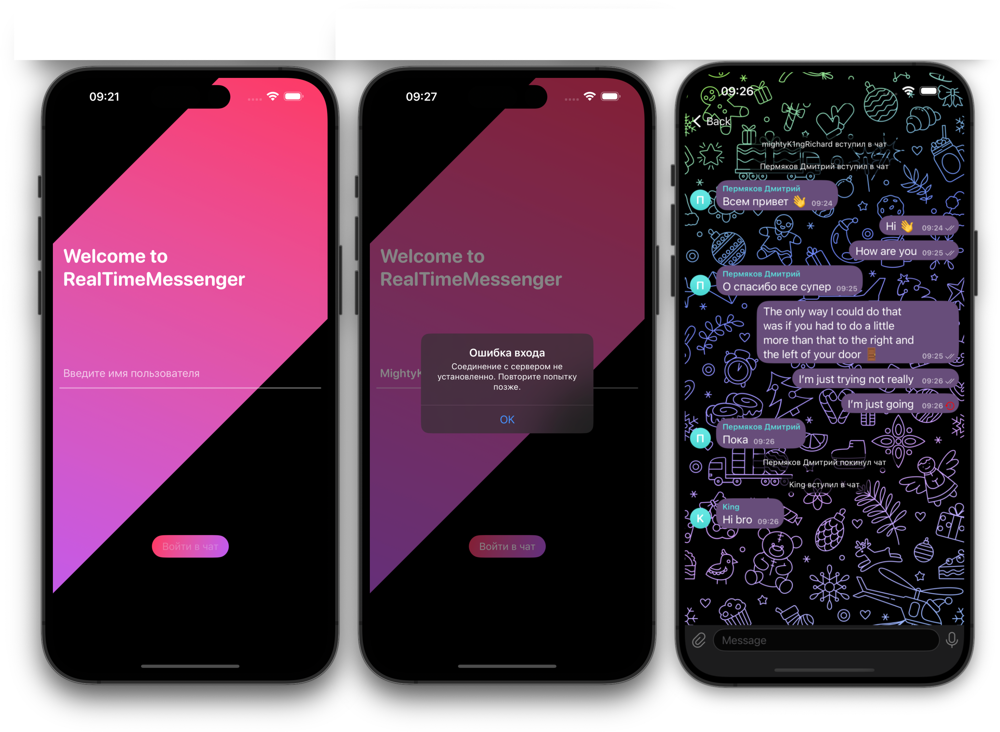

# RealTimeMessenger-iOS
 iOS Real Time Messenger. Сетевые технологии, МГТУ, ИУ5, Курсовая работа, прикладной уровень.

## Цель работы:
Реализовать систему обмена текстовыми сообщениями в реальном времени, состоящую из трех уровней: прикладной, транспортный и канальный.

Интерфейс реализован на SwiftUI. Дизайн копирует приложение Telegram. Приложение представляет собой окно чата с возможностью ввода текстового сообщения. При подключении необходимо ввести имя пользователя (открытие WebSocket соединения), которое будет передаваться с каждым сообщением. При обновлении страницы история чата не сохраняется. С помощью кнопки выйти можно отчистить чат и логин (закрытие WebSocket соединения), чтобы потом сменить пользователя. Если сообщение пришло с признаком ошибки - текст отображается только отправителю с иконкой ошибки.

Для метода Send формирует json сообщение с указанием отправителя, времени отправки и полезной нагрузки - текста. При получении нового сообщения методом Receive - json с указанием отправителя, времени отправки, признака ошибки и полезной нагрузки.

[WebSocketServer](https://github.com/mightyK1ngRichard/RealTimeMassengerAPI) - WebSocket + HTTP cервер. Технология: Vapor, Swift

## Preview

  

